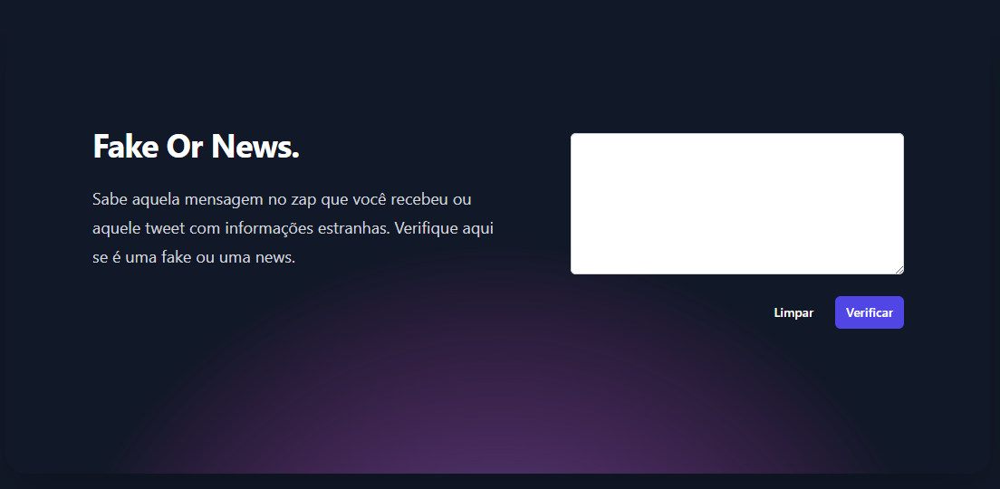
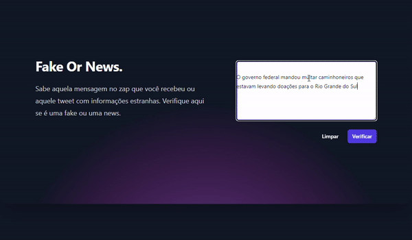

# Fake or News
Verificador de veracidade de mensagens

Aproveite para testar pelo link abaixo:
[https://fake-or-news.vercel.app/](https://fake-or-news.vercel.app/)

### Descrição
Com a intenção de usar IAs para impactar positivamente a vida de pessoas, esse projeto serve para validar mensagens com os rótulos: Fake, News ou Opinião.

Para isso é usada a LLM do google Gemini 1.5 pro e foi realizada durante as aulas da Imersão Alura + Google.

Foi usada uma técnica de Few-Shot para a criação do prompt.

### Resultados

A seguir um gif de exemplo como a plataforme Fake or News funciona.

